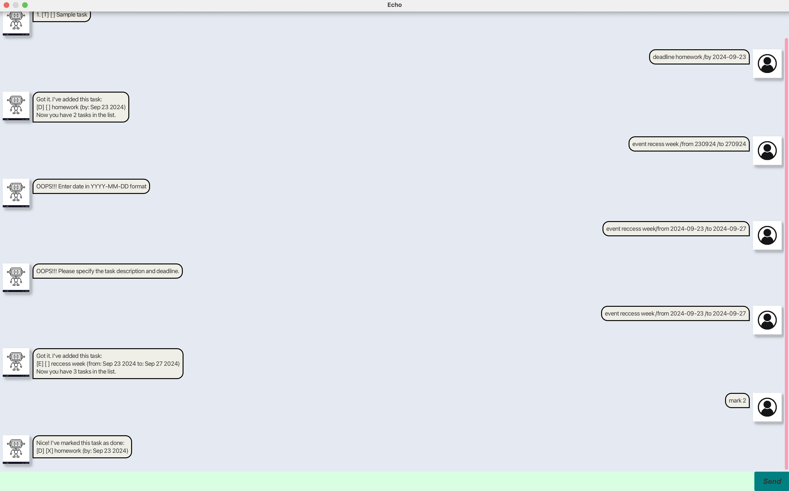

# Echo User Guide



Echo is a task management application that helps you organize your tasks, deadlines, and events. It supports multiple
task types and features like adding, marking, and deleting tasks, with a clean, easy-to-use interface. It is
interactive and feels like a real work buddy.


## Quick Start Guide

1. Ensure Java 17 is installed on your device.
1. Download the JAR file from this repository.
1. Place the JAR file in a directory and run it by double-clicking.
1. Type the desired command and click enter or the send button to interact with echo.


## Features


### Adding Todos `todo`

Adds a todo task that has no deadline

enter: "todo [task name]"

Example: `todo homework`

```
Got it. I've added this task:
［T]［] homework
Now you have 2 tasks in the list.
```


### Adding Deadlines `deadline`

Adds a deadline task that has a deadline

enter: "deadline [task name] /by [date in YYYY-MM-DD]"

Example: `deadline IP /by 2024-09-23`

```
Got it. I've added this task:
[D] [] IP (by: Sep 23 2024)
Now you have 3 tasks in the list.
```

### Adding Events `event`

Adds an event that has a start date and an end date

enter: "event [event name] /from [date in YYYY-MM-DD] /to [date in YYYY-MM-DD]"

Example: `event reccess week /from 2024-09-23 /to 2024-09-27`

```
Got it. I've added this task:
[E] [] reccess week (from: Sep 23 2024 to: Sep 27 2024)
Now you have 4 tasks in the list.
```


### Listing tasks `list`

List all events recorded

enter: "list"

Example: `list`

```dtd
1. [T] [] Sample task
2. [T] [ ] homework
3. [D] [] IP (by: Sep 23 2024)
4. [E] [] reccess week (from: Sep 23 2024 to: Sep 27 2024)|
```

### mark `mark`

mark a task as done

enter: "mark [task number as shown in list]"

Example: `mark 2`

```dtd
Nice! I've marked this task as done:
［T］［X] homework
```

### unmark `unmark`

unmark a task as done

enter: "unmark [task number as shown in list]"

Example: `unmark 2`

```dtd
OK, I've marked this task as not done yet:
[T] [ ] homework
```
### delete `delete`

removes a task from the record
enter: "delete [task number as shown in list]"

Example: `delete 2`

```dtd
Noted. I've removed this task:
[T] [X] homework
Now you have 3 tasks in the list.
```

### find `find`

find a task with the given word
enter: "find [word that exist in a task]"
Example: `find week`

```dtd
1. [E] [] reccess week (from: Sep 23 2024 to: Sep 27
2024)
```

### edit `edit`

edits a task that already exist in the list

enter: "edit [task number as shown in list]"

```dtd
What would you like to edit in task [D] [ ] project (by:
Oct 1 2024)?
```

enter: "[part to change] [new value]"

#### parts
* name (all task type)
* by (deadline)
* start (event)
* end (event)


Example:`edit 2`

```dtd
What would you like to edit in task [E] [] reccess week (from: Sep 23 2024 to: Sep 27 2024)?
```

`end 2024-10-01`

```dtd
Ok. End date changed to 2024-10-01
```